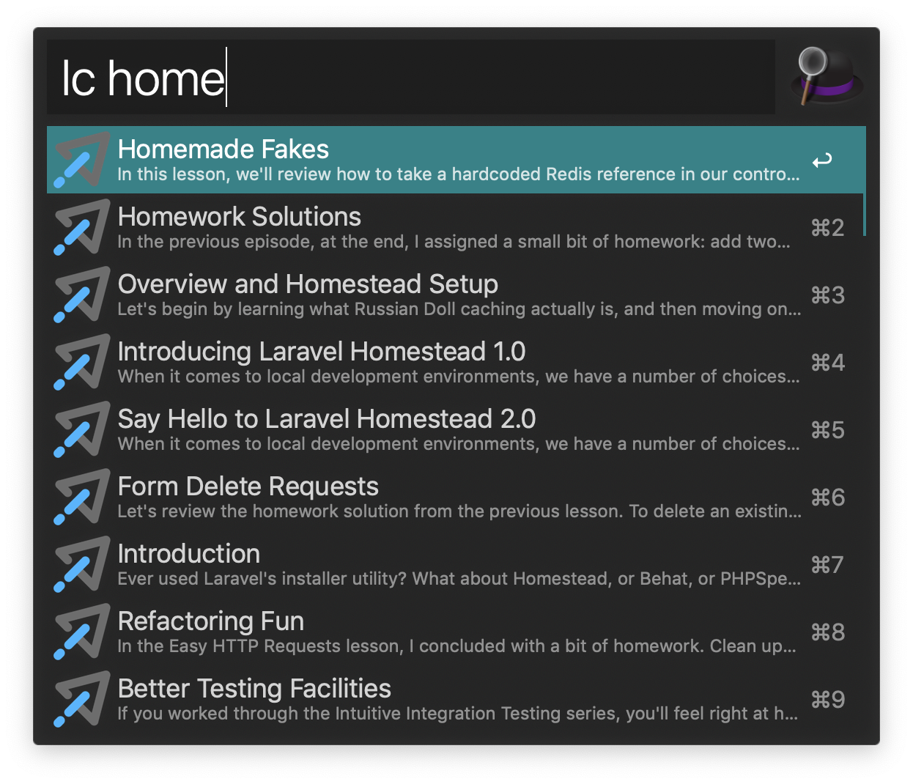

# Laracass Lessons Workflow for Alfred

An ultra-fast Laracasts lessons search workflow for [Alfred 4](https://www.alfredapp.com).



Based on, and inspired by [Laravel Docs Search](https://github.com/tillkruss/alfred-laravel-docs) by [Till Krüss](https://github.com/tillkruss)

## Installation

1. [Download the latest version](https://github.com/egyptik/alfred-laracasts-lessons/releases/download/0.1.0/Laracasts.Lessons.alfredworkflow)
2. Install the workflow by double-clicking the `.alfredworkflow` file
3. You can add the workflow to a category, then click "Import" to finish importing. You'll now see the workflow listed in the left sidebar of your Workflows preferences pane.

## Usage

Just type `lc` followed by your search query.

```
lc <query>
lc pizza time
```

Either press `⌘Y` to Quick Look the result, or press `<enter>` to open it in your web browser.
